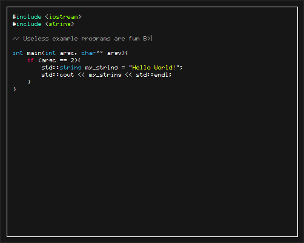

## VTTE (Very Tiny Text Editor)
**A mini and minimal text editor**



VTTE is a minimal and distraction free text editor with a tiny font (hence the name) built using QT. While it started as somewhat of a joke I've come to appreciate it and am now developing it into a more feature complete editor.

#### Why QT?
While there are less bloated libraries I could have used, QT is no doubt the easiest GUI library for C++ and has everything I need to do what I want. Many libraries either don't give enough control or are simply too complex to quickly make an editor. QT acts as a nice middle ground and thats why it's being used.

#### What is the end goal?
The end goal is quite simple. I want VTTE to be a feature complete editor while remaining completely minimal with almost no UI bloat.

## Build
### Dependencies
QT5+ (Currently developed with 6.2.3)
You may need to use the QT devkit from https://www.qt.io/download-qt-installer

### Building
```bash
cd build
cmake ../
make
```

This will produce the file `vtte` which you can copy to relevant binary directories
